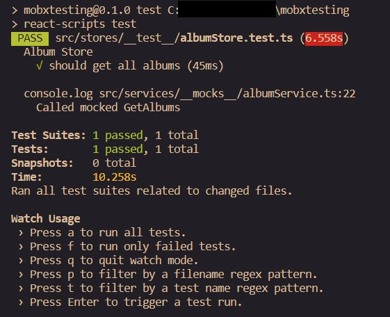

## React and Mobx Store Unit Testing and Mocking With Jest

[Link to the repository](https://github.com/camposleite/mobxtesting)

This project was bootstrapped with [Create React App](https://github.com/facebook/create-react-app).

Researching how to do unit tests of a Mobx store, I came across examples that, although useful, were not exactly what I was looking for, as their stores did not access a http service, as was the case of the project I was working on.

The project stores did not receive instances of services by dependency injection, so it was not possible to inject a mock of the service.

#### Enter Jest

As the project uses Jest, I realized that I could leave Jest in charge of mocking the services. And I found it was quite simple.

#### Tools

- [mobx](https://mobx.js.org/) and [mobx-react](https://github.com/mobxjs/mobx-react): `$ npm i mobx mobx-react --save-dev`
- [jest](https://jestjs.io/)
- @types/jest: `$ npm install --save @types/jest`
- http://jsonplaceholder.typicode.com

#### Basic folder structure before

    src/
       components/
            albumComponent.tsx
       services/
            albumService.ts
       stores/
            albumStore.ts
       App.js
       index.js
       ...

#### Basic folder structure after

Using jest for testing, we create a **test** folder in the same level of the component we are testing. In our case, the albumStore.ts

For the mock, we create a **mocks** folder in the same level of the component we want to mock. Note: the name of the mock file must be the same of the original file (albumService.ts) being mocked, so jest can undestand and mock during the tests.

So the folder structure looks like as following:

    src/
       components/
            albumComponent.tsx
       services/
            __mocks__/
                albumService.ts
            albumService.ts
       stores/
            __test__/
                albumStore.test.ts
            albumStore.ts
       App.js
       index.js
       ...

#### Simple service using Fetch

```javascript
class AlbumService {
  public async GetAlbums() {
    let response = await fetch("http://jsonplaceholder.typicode.com/albums");
    let data = await response.json();
    return data;
  }
}

export default new AlbumService();
```

#### Simple Mobx store calling the service

```javascript
import { action, observable } from "mobx";
import albumService from "../services/albumService";
import { AlbumDto } from "../services/dto/albumDto";

class AlbumStore {
  @observable albums: AlbumDto[] = [];

  @action
  async getAlbums() {
    const result = await albumService.GetAlbums();

    this.albums = result;
  }
}

export default AlbumStore;
```

## Let´s go test

#### First, the mocked album service

```javascript
class AlbumService {
  albums = [
    {
      userId: 1,
      id: 1,
      title: "Album 1",
    },
    {
      userId: 1,
      id: 2,
      title: "Album 2",
    },
    {
      userId: 1,
      id: 3,
      title: "Album 3",
    },
  ];

  public async GetAlbums() {
    return new Promise((resolve) => {
      console.log("Called mocked GetAlbums");
      process.nextTick(() => resolve(this.albums)); //Resolving the promise with the mocked list
    });
  }
}

export default new AlbumService();
```

#### Finally, the album store tests (albumStore.test.ts)

```javascript
//Here we are telling Jest to pick the mocked version when the store make a call to the album service.
jest.mock("../../services/albumService");

import AlbumStore from "../albumStore";

describe("Album Store", () => {
  it("should get all albums", async () => {
    const store = new AlbumStore();

    //Some simple tests
    expect(store.albums).not.toBeUndefined();
    expect(store.albums).not.toBeNull();
    expect(store.albums.length).toBe(0);

    await store.getAlbums();

    expect(store.albums).not.toBeUndefined();
    expect(store.albums).not.toBeNull();
    expect(store.albums.length).toBeGreaterThan(0);
  });
});
```

#### Running the tests

```
npm test
```

#### Voila! The tests are working and using the mocked version of the service



#### Final thoughts

There's more than one way to skin a cat. This is just a simple way to mock a component and there is a lot more that Jest can do. I hope it can help you.

Keep on!
